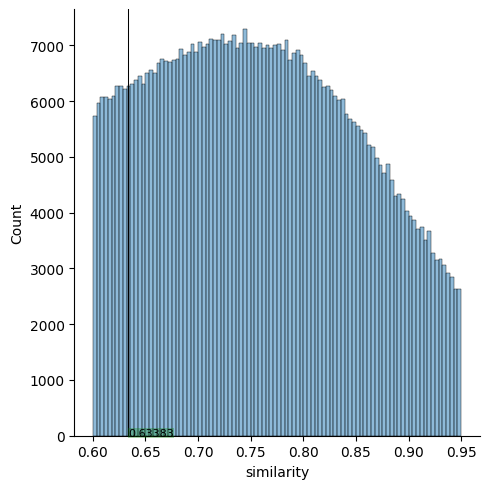
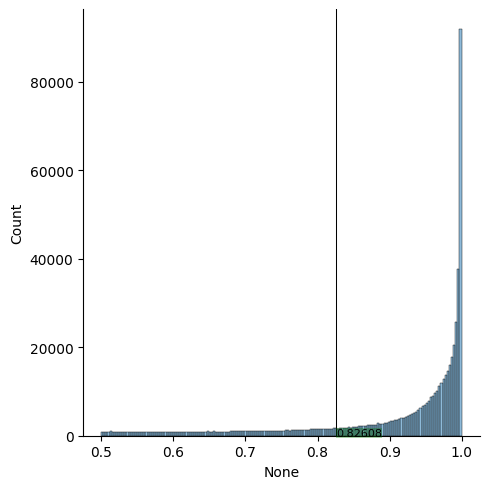
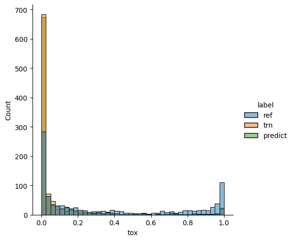
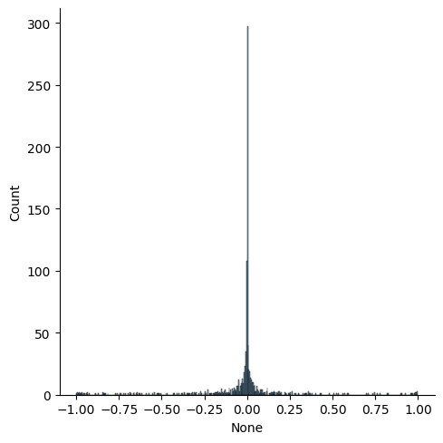

# Final Solution Report

## Data processing

First thing that I found while exploring data that both reference and translation columns had low and high toxicity messages. So I decided that I should make reference a column with toxic sentences and a translation column a target with non-toxic sentences.
 
Then I decided to check if original paraphrasing is good enough. For that I checked similarity distribution. 
From here I understood that similarity throught dataset is good enough since it is higher than 0.6 for whole data. However I decided to make it higher by cutting off 10% of dataset with low similarity
 
Then I checked how good is detoxification in this dataset, so I made a plot of the difference of ref_tox and trn_tox metrics.
 From here we can see that mostly difference is high. Since modeling will fine-tuning paraphrasing model I decided to cut off 20% with lower difference

## Modeling

With my resourses I decided to use pretraind paraphraser. Since paraphraser has no context about toxicity I needed to fine tune it. For pretrained model I got bart-paraphraser from huggingface.co. Since resources limitation I traind 2 epochs. However during training I have seen that loss started to stagnate so I could even use early stopping.

## Prediction and Evaluation

For evaluation I decided to compare toxicity metric for predicted sentences. Since I took completed evaluation metric it differed from original toxicity reult in dataset. So I evaluated whole dataset with predicted sentences.

From plot we can see that distribution of predictid toxicity and original is quite similar and The peek is near 0.

And from plot of difference of target and prediction we can see that results are good
